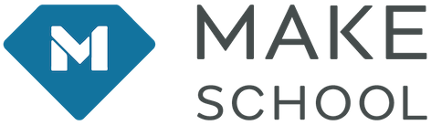

<h1 align="center">Welcome to MSConsole 👋</h1>
</a>
<p>
  <a>
    <a href="https://goreportcard.com/badge/github.com/tempor1s/msconsole-go" />
    
    <a href="https://github.com/tempor1s/msconsole/commits/master">
    
  </a> 
  <a href="#" target="_blank">
    
  </a>
  <a href="https://github.com/imthaghost/gitmoji-changelog">
    
  </a>
  
</p>

> A suite of tools that makes your MakeSchool life easier!

## 🚀 Getting Started

### Use the tool!

```bash
# tap the repo
brew tap tempor1s/msconsole
# install the CLI tool
brew install msconsole
# get a list of all the commands
ms
```

## License

By contributing, you agree that your contributions will be licensed under its MIT License.

## Contributors

<table>
  <tr>
    <td align="center"><a href="https://github.com/tempor1s"><br /><sub><b>Ben Lafferty</b></sub></a><br /><a href="https://github.com/tempor1s/msconsole/commits?author=tempor1s" title="Code">💻</a></td>
    <td align="center"><a href="https://github.com/imthaghost"><br /><sub><b>Tha Ghost</b></sub></a><br /><a href="https://github.com/tempor1s/msconsole/commits?author=imthaghost" title="Code">💻</a></td>
  </tr>
